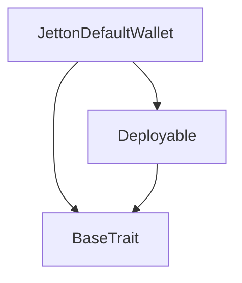
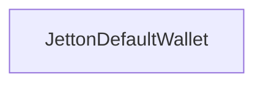

# TACT Compilation Report
Contract: JettonDefaultWallet
BOC Size: 2001 bytes

# Types
Total Types: 23

## StateInit
TLB: `_ code:^cell data:^cell = StateInit`
Signature: `StateInit{code:^cell,data:^cell}`

## StdAddress
TLB: `_ workchain:int8 address:uint256 = StdAddress`
Signature: `StdAddress{workchain:int8,address:uint256}`

## VarAddress
TLB: `_ workchain:int32 address:^slice = VarAddress`
Signature: `VarAddress{workchain:int32,address:^slice}`

## Context
TLB: `_ bounced:bool sender:address value:int257 raw:^slice = Context`
Signature: `Context{bounced:bool,sender:address,value:int257,raw:^slice}`

## SendParameters
TLB: `_ bounce:bool to:address value:int257 mode:int257 body:Maybe ^cell code:Maybe ^cell data:Maybe ^cell = SendParameters`
Signature: `SendParameters{bounce:bool,to:address,value:int257,mode:int257,body:Maybe ^cell,code:Maybe ^cell,data:Maybe ^cell}`

## Deploy
TLB: `deploy#946a98b6 queryId:uint64 = Deploy`
Signature: `Deploy{queryId:uint64}`

## DeployOk
TLB: `deploy_ok#aff90f57 queryId:uint64 = DeployOk`
Signature: `DeployOk{queryId:uint64}`

## FactoryDeploy
TLB: `factory_deploy#6d0ff13b queryId:uint64 cashback:address = FactoryDeploy`
Signature: `FactoryDeploy{queryId:uint64,cashback:address}`

## ChangeOwner
TLB: `change_owner#819dbe99 queryId:uint64 newOwner:address = ChangeOwner`
Signature: `ChangeOwner{queryId:uint64,newOwner:address}`

## ChangeOwnerOk
TLB: `change_owner_ok#327b2b4a queryId:uint64 newOwner:address = ChangeOwnerOk`
Signature: `ChangeOwnerOk{queryId:uint64,newOwner:address}`

## InternalAdd
TLB: `internal_add#12412733 amount:coins origin:address = InternalAdd`
Signature: `InternalAdd{amount:coins,origin:address}`

## TokenTransfer
TLB: `token_transfer#0f8a7ea5 queryId:uint64 amount:coins destination:address responseDestination:Maybe address customPayload:Maybe ^cell forwardTonAmount:coins forwardPayload:remainder<slice> = TokenTransfer`
Signature: `TokenTransfer{queryId:uint64,amount:coins,destination:address,responseDestination:Maybe address,customPayload:Maybe ^cell,forwardTonAmount:coins,forwardPayload:remainder<slice>}`

## TokenUpdateContent
TLB: `token_update_content#0c087a9e content:Maybe ^cell = TokenUpdateContent`
Signature: `TokenUpdateContent{content:Maybe ^cell}`

## TokenBurn
TLB: `token_burn#595f07bc queryId:uint64 amount:coins owner:address responseAddress:Maybe address = TokenBurn`
Signature: `TokenBurn{queryId:uint64,amount:coins,owner:address,responseAddress:Maybe address}`

## TokenBurnNotification
TLB: `token_burn_notification#7bdd97de queryId:uint64 amount:coins owner:address responseAddress:Maybe address = TokenBurnNotification`
Signature: `TokenBurnNotification{queryId:uint64,amount:coins,owner:address,responseAddress:Maybe address}`

## TokenNotification
TLB: `token_notification#7362d09c queryId:uint64 amount:coins from:address forwardPayload:remainder<slice> = TokenNotification`
Signature: `TokenNotification{queryId:uint64,amount:coins,from:address,forwardPayload:remainder<slice>}`

## TokenExcesses
TLB: `token_excesses#d53276db queryId:uint64 = TokenExcesses`
Signature: `TokenExcesses{queryId:uint64}`

## TokenTransferInternal
TLB: `token_transfer_internal#178d4519 queryId:uint64 amount:coins from:address responseAddress:Maybe address forwardTonAmount:coins forwardPayload:remainder<slice> = TokenTransferInternal`
Signature: `TokenTransferInternal{queryId:uint64,amount:coins,from:address,responseAddress:Maybe address,forwardTonAmount:coins,forwardPayload:remainder<slice>}`

## JettonData
TLB: `_ totalSupply:int257 mintable:bool owner:address content:Maybe ^cell walletCode:^cell = JettonData`
Signature: `JettonData{totalSupply:int257,mintable:bool,owner:address,content:Maybe ^cell,walletCode:^cell}`

## JettonWalletData
TLB: `_ balance:int257 owner:address parent:address walletCode:^cell = JettonWalletData`
Signature: `JettonWalletData{balance:int257,owner:address,parent:address,walletCode:^cell}`

## JettonDefaultWallet$Data
TLB: `null`
Signature: `null`

## Mint
TLB: `mint#fc708bd2 amount:int257 receiver:address = Mint`
Signature: `Mint{amount:int257,receiver:address}`

## SampleJetton$Data
TLB: `null`
Signature: `null`

# Get Methods
Total Get Methods: 1

## get_wallet_data

# Error Codes
2: Stack underflow
3: Stack overflow
4: Integer overflow
5: Integer out of expected range
6: Invalid opcode
7: Type check error
8: Cell overflow
9: Cell underflow
10: Dictionary error
11: 'Unknown' error
12: Fatal error
13: Out of gas error
14: Virtualization error
32: Action list is invalid
33: Action list is too long
34: Action is invalid or not supported
35: Invalid source address in outbound message
36: Invalid destination address in outbound message
37: Not enough TON
38: Not enough extra-currencies
39: Outbound message does not fit into a cell after rewriting
40: Cannot process a message
41: Library reference is null
42: Library change action error
43: Exceeded maximum number of cells in the library or the maximum depth of the Merkle tree
50: Account state size exceeded limits
128: Null reference exception
129: Invalid serialization prefix
130: Invalid incoming message
131: Constraints error
132: Access denied
133: Contract stopped
134: Invalid argument
135: Code of a contract was not found
136: Invalid address
137: Masterchain support is not enabled for this contract
3734: Not Owner
4429: Invalid sender
13650: Invalid bounced message
16059: Invalid value
18668: Can't Mint Anymore
62972: Invalid balance

# Trait Inheritance Diagram

# Contract Dependency Diagram

